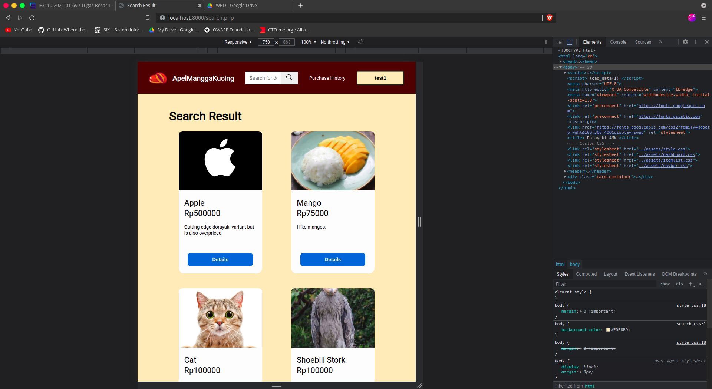

# Deskripsi Aplikasi Web

Aplikasi Web Dorayaki Apel Mangga Kucing merupakan suatu aplikasi web untuk pembelian dorayaki. Pengguna untuk menggunakan aplikasi harus melakukan login terlebih dahulu dengan akun yang sudah dibuat. Akun dapat dibuat melalui halaman register. Setelah login, pengguna akan diarahkan ke halaman dashboard. Dashboard menunjukkan top 8 varian dorayaki dari total penjualan. Pada aplikasi web terdapat suatu header yang berupa navigation bar yang juga memiliki suatu search bar. Search bar dapat dipakai untuk mencari varian dorayaki berdasarkan nama varian dorayaki. Navigation bar untuk pengguna juga menunjukkan username pengguna, yang ketika di-hover akan menunjukkan tombol logout. Ada juga tombol untuk pergi ke halaman riwayat pembelian di Navigation bar yang akan mengarahkan pengguna ke riwayat pembeliannya. Dengan meng-klik tombol di card varian dorayaki yang ada di dashboard atau hasil pencarian, pengguna akan diarahkan ke halaman detail dorayaki. Dari halaman ini pengguna dapat meng-klik tombol untuk diarahkan ke halaman pembelian di mana pengguna dapat memilih banyaknya dorayaki yang ingin dibeli dari varian tersebut. Ada pengguna khusus yang berupa admin. Untuk admin, ada beberapa fitur yang berbeda. Fitur ini adalah penambahan varian dorayaki, yang halamannya dapat diakses dari navigation bar. Ada juga fitur perubahan stok varian dorayaki, perubahan detail dorayaki, dan penghapusan varian dorayaki.

# Daftar Requirement

1. PHP
2. SQLite3
3. Docker
4. Apache Server / NGINX

# Cara Instalasi

### Melalui Lokal

1. Install PHP pada sistem operasi yang digunakan
2. Install Apache Server pada sistem operasi yang digunakan
3. Install SQLite pada sistem operasi yang digunakan

### Melalui Docker

1. Install Docker, dapat mengikuti panduan pada https://docs.docker.com/engine/install/
2. Install Docker Compose, dapat mengikuti panduan pada https://docs.docker.com/compose/install/

# Cara Menjalankan Server

### Melalui Lokal

1. Jalankan `PHP -S localhost:{port}` di directory repository ({port} dapat diganti dengan nilai seperti 8000)

### Melalui Docker

1. Jalankan perintah `docker-compose up` di directory repository

# Screenshot Tampilan Aplikasi

1. Halaman Login
   
2. Halaman Register
   

3. Halaman Dashboard

   #### User Dashboard

   
   

   #### Admin Dashboard

   

4. Halaman Hasil Pencarian
   
   

5. Halaman Penambahan Varian Dorayaki Baru
   

6. Halaman Detail Varian Dorayaki

   #### User Detail Variant

   

   #### Admin Detail Variant

   
   

7. Halaman Pengubahan Stok / Pembelian Dorayaki
   
   

8. Data Expire Time
   

9. Responsive Design
   
   
   
   
   
   
   
   
   

10. Halaman Riwayat Pengubahan Stok / Pembelian Dorayaki
    

# Pembagian Tugas

<ins>Server-side</ins>

- Register: 13519096
- Riwayat: 13519096
- Add Variant: 13519096
- Login: 13519048, 13519096
- Dashboard: 13519048
- Pencarian dan hasil pencarian: 13519090
- Detail Dorayaki: 13519090
- Pembelian/Pengubahan Stok Dorayaki: 13519090
- Edit & Delete Variant Dorayaki : 13519090

<ins>Client-side</ins>

- Register: 13519096
- Riwayat: 13519096
- Add Variant: 13519096
- Login: 13519048
- Dashboard: 13519048
- Pencarian dan hasil pencarian: 13519090
- Detail Dorayaki: 13519090
- Pembelian/Pengubahan Stok Dorayaki: 13519090
- Edit & Delete Variant Dorayaki : 13519090
- Navbar, Komponen HTML : 13519048

<ins>Misc</ins>

- Docker: 13519096
- Responsive Web: 13519090
- Data Expire Time: 13519096
- Debugging: 13519090, 13519096
